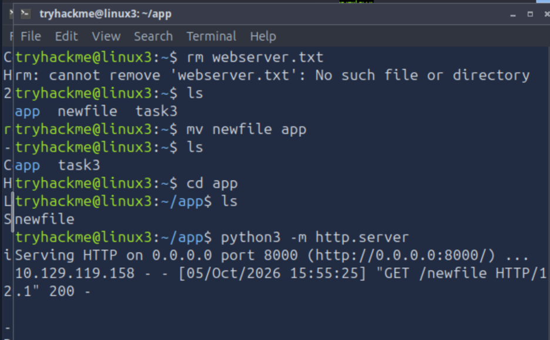
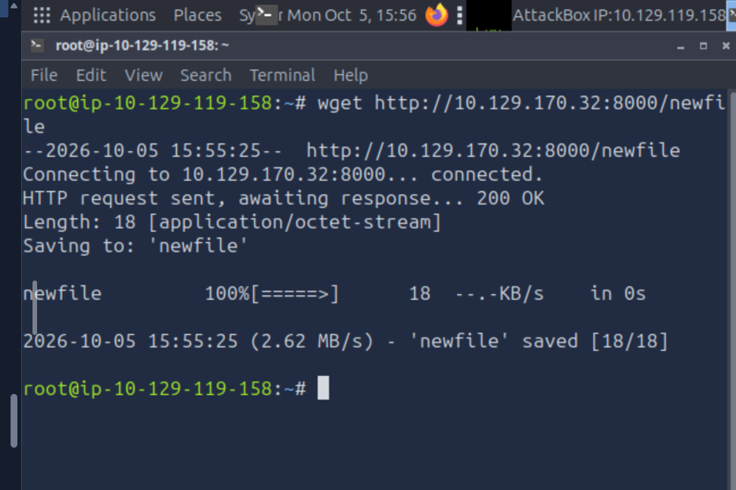

# Linux Fundamentals

**Platform:** TryHackMe – Cyber Security 101  
**Module:** Linux Fundamentals (Parts 1–3)  
**Status:** Completed  

## Overview

Completed hands-on Linux exercises covering command-line navigation, file management, remote access, file transfer, process monitoring, service management, task automation and log analysis.

## Technical Skills Practised

| Area | Commands / Tools | Practical Application |
|---|---|---|
| Linux CLI | `whoami`, `echo`, `ls`, `cd` | User identification, command-line navigation and displaying output |
| File Management | `mkdir`, `mv`, `cp`, `rm`, `cat` | Creating directories, moving, copying, removing and viewing files |
| Text Editing | `nano`, `vim` | Creating and editing files directly from the terminal |
| Remote Access | `ssh` | Connecting remotely to another Linux system |
| User Management | Linux user commands | Working with users and switching between accounts |
| File Transfer | `wget`, `scp` | Downloading and securely transferring files between systems |
| HTTP File Sharing | `python3 -m http.server` | Hosting files for retrieval from another machine |
| Process Monitoring | `ps`, `top` | Identifying running processes and monitoring system activity |
| Service Management | `systemctl` | Starting and managing Linux services |
| Task Automation | `cron` | Understanding scheduled task automation |
| Log Analysis | Apache2 access logs | Reviewing HTTP activity, source IP addresses and requested resources |

## Practical Exercise – Linux File Transfer

As part of the practical lab, I used two Linux systems to demonstrate file hosting and retrieval.

### HTTP Server

I moved a file into the required directory and started a temporary Python HTTP server:

```bash
mv newfile app
cd app
ls
python3 -m http.server
```

The HTTP server successfully received a `GET` request for the hosted file from the second Linux system.

### File Retrieval

From the second Linux system, I used `wget` to retrieve the hosted file:

```bash
wget http://<server-ip>:8000/newfile
```

The request returned `200 OK` and the file was successfully downloaded.

## Evidence

### Python HTTP Server

The screenshot below shows the temporary Python HTTP server running and recording the successful request for `newfile`.



### File Retrieval with wget

The second Linux system successfully connected to the HTTP server and retrieved the file using `wget`.



## Security Relevance

These exercises strengthened practical Linux skills relevant to IT administration and cybersecurity, particularly working from the command line, accessing remote systems, transferring files, monitoring processes and services, and reviewing system and application logs.

Reviewing Apache2 access logs also provided practical experience identifying source IP addresses and requested resources, which is directly relevant to investigating activity during security monitoring.

## Key Takeaway

Completing Linux Fundamentals gave me greater confidence working directly with Linux systems rather than relying on graphical interfaces. I can navigate the filesystem, manage files, connect to remote systems, transfer data, inspect processes and services, and review logs when investigating system activity.
